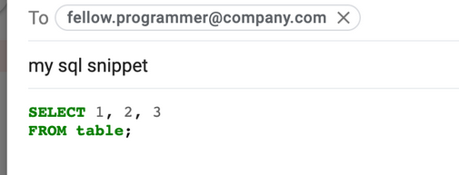
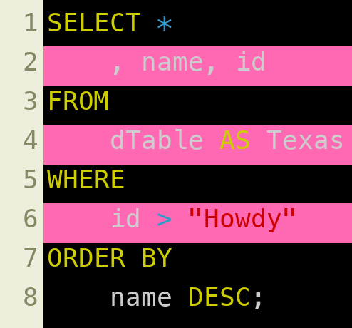

# bashfoo.yaml

[https://github.com/dannguyen/bashfoo](https://github.com/dannguyen/bashfoo)

Dan Nguyen's personally curated list of bash/command-line commands and snippets
  that are useful but yet he keeps forgetting


## TOC

- [`date` add a UTC timestamp in ISO-8601 format to a filename](#manifest--date-add-a-utc-timestamp-in-iso-8601-format-to-a-filename)
- [`ffmpeg` convert a video to gif](#manifest--ffmpeg-convert-a-video-to-gif)
- [`ffmpeg` encode .mkv video to .mp4](#manifest--ffmpeg-encode-mkv-video-to-mp4)
- [`ffmpeg` optimize video and reduce its file size](#manifest--ffmpeg-optimize-video-and-reduce-its-file-size)
- [`ffmpeg` resize a video and preserve its aspect ratio](#manifest--ffmpeg-resize-a-video-and-preserve-its-aspect-ratio)
- [`find` and execute command on each file](#manifest--find-and-execute-command-on-each-file)
- [`find` and list the top 10 most recently modified subdirectories](#manifest--find-and-list-the-top-10-most-recently-modified-subdirectories)
- [`find` and tally total kilobytes of hard disk space for files with given extension(s)](#manifest--find-and-tally-total-kilobytes-of-hard-disk-space-for-files-with-given-extension-s-)
- [`find` directory name recursively](#manifest--find-directory-name-recursively)
- [`find` file by name](#manifest--find-file-by-name)
- [`magick` convert image to favicon.ico](#manifest--magick-convert-image-to-favicon-ico)
- [`ogr2ogr` convert a shapefile into CSV + GeoJSON](#manifest--ogr2ogr-convert-a-shapefile-into-csv-geojson)
- [`pandoc` convert a Markdown file into a Word docx](#manifest--pandoc-convert-a-markdown-file-into-a-word-docx)
- [`pgrep` and get all process info](#manifest--pgrep-and-get-all-process-info)
- [`pkill` using a file pattern](#manifest--pkill-using-a-file-pattern)
- [`printf` to stderr](#manifest--printf-to-stderr)
- [`pygmentize` a code snippet into highlighted rich text that I can paste into GMail](#manifest--pygmentize-a-code-snippet-into-highlighted-rich-text-that-i-can-paste-into-gmail)
- [`rsync` the contents of one directory into another](#manifest--rsync-the-contents-of-one-directory-into-another)
- [`ssh-add` a new SSH key to system ssh-agent (macOS)](#manifest--ssh-add-a-new-ssh-key-to-system-ssh-agent-macos-)
- [`stem` a filename, i.e. get filename sans path or extension](#manifest--stem-a-filename-i-e-get-filename-sans-path-or-extension)
- [`tar` extraction, verbose](#manifest--tar-extraction-verbose)
- [`unzip` only an archive's CSV files and pipe to stdout](#manifest--unzip-only-an-archive-s-csv-files-and-pipe-to-stdout)
- [`xargs` (BSD) to pipe results into another command, one at a time](#manifest--xargs-bsd-to-pipe-results-into-another-command-one-at-a-time)
- [`youtube-dl` to download just a video's transcript/subtitle files](#manifest--youtube-dl-to-download-just-a-video-s-transcript-subtitle-files)


-------------------------------
<a name="manifest--date-add-a-utc-timestamp-in-iso-8601-format-to-a-filename" id="manifest--date-add-a-utc-timestamp-in-iso-8601-format-to-a-filename"></a>

### `date` add a UTC timestamp in ISO-8601 format to a filename

```sh
# Example
# Just the current UTC date using GNU date, i.e. gdate on macOS
printf "mydata_%s.csv\n" $(gdate --utc -I)
# >>>> mydata_2021-08-03.csv

# UTC date with hours+minutes, GNU and BSD compatible
printf "mydata_%s.csv\n" $(date -u +"%Y-%m-%d-%H%M")
# >>>> mydata_2021-08-03-1248.csv
```

**References**: 

- [date command --iso-8601 option](https://unix.stackexchange.com/questions/164826/date-command-iso-8601-option)


-------------------------------
<a name="manifest--ffmpeg-convert-a-video-to-gif" id="manifest--ffmpeg-convert-a-video-to-gif"></a>

### `ffmpeg` convert a video to gif

```sh
# Example
# minimalist conversion (infinite looping GIF, i.e. -loop=0, is the default)
ffmpeg -i input.mp4 output.gif

# yes-to-overwrite, 15 frames-per-second
# scaled to 225px wide w/ lanczos scaler, and non-looping
ffmpeg -y -i input.mp4 \
  -vf "fps=15,scale=225:-1:flags=lanczos" -loop -1 \
  output.gif

# generate a palette png file that favors areas with motion
ffmpeg -y -i input.mp4 -vf "palettegen=stats_mode=diff" palette.png

# and then use that palette png
ffmpeg -y -i input.mp4 -i palette.png -lavfi paletteuse output.gif
```

**References**: 

- [How do I convert a video to GIF using ffmpeg, with reasonable quality?](https://superuser.com/a/556031)
- [Optimizing GIFS with FFMPEG](https://cassidy.codes/blog/2017/04/25/ffmpeg-frames-to-gif-optimization/)
- [High quality GIF with FFmpeg](https://web.archive.org/web/20200612084604/http://blog.pkh.me/p/21-high-quality-gif-with-ffmpeg.html)


-------------------------------
<a name="manifest--ffmpeg-encode-mkv-video-to-mp4" id="manifest--ffmpeg-encode-mkv-video-to-mp4"></a>

### `ffmpeg` encode .mkv video to .mp4

```sh
# Example
ffmpeg -i input.mkv -acodec aac -vcodec libx264 output.mp4
```

**References**: 

- [How can I convert an m4v video to a widely viewable format using ffmpeg?](https://superuser.com/a/462112/512499)


-------------------------------
<a name="manifest--ffmpeg-optimize-video-and-reduce-its-file-size" id="manifest--ffmpeg-optimize-video-and-reduce-its-file-size"></a>

### `ffmpeg` optimize video and reduce its file size

```sh
# Example
ffmpeg -i my_video.mp4 -vcodec libx264 -crf 28 my_video_optimized.mp4
```

**References**: 

- [How can I reduce a video's size with ffmpeg?](https://unix.stackexchange.com/questions/28803/how-can-i-reduce-a-videos-size-with-ffmpeg)


-------------------------------
<a name="manifest--ffmpeg-resize-a-video-and-preserve-its-aspect-ratio" id="manifest--ffmpeg-resize-a-video-and-preserve-its-aspect-ratio"></a>

### `ffmpeg` resize a video and preserve its aspect ratio

```sh
# Example
# to rescale a video's width to 450 pixels and autoscale its height
ffmpeg -i in_video.mp4 -vf scale=450:-2 out_video.mp4

# to rescale a video's height to 204 pixels and autoscale its width
ffmpeg -i in_video.mp4 -vf scale=-2:204 out_video.mp4

# Note that the given pixel width/height should be an even number
# to avoid getting an error like: height not divisible by 2 (500x201)
```

**References**: 

- [How to resize a video to make it smaller with FFmpeg](https://superuser.com/questions/624563/how-to-resize-a-video-to-make-it-smaller-with-ffmpeg)
- [FFMPEG (libx264) "height not divisible by 2"
](https://stackoverflow.com/questions/20847674/ffmpeg-libx264-height-not-divisible-by-2)


-------------------------------
<a name="manifest--find-and-execute-command-on-each-file" id="manifest--find-and-execute-command-on-each-file"></a>

### `find` and execute command on each file

```sh
# Example
find ./PATTERN -exec FOO BAR {} \;

find PlainText/*.md -exec wc -l {} \;
```

**References**: 

- [How to run find -exec?](https://unix.stackexchange.com/questions/12902/how-to-run-find-exec)


-------------------------------
<a name="manifest--find-and-list-the-top-10-most-recently-modified-subdirectories" id="manifest--find-and-list-the-top-10-most-recently-modified-subdirectories"></a>

### `find` and list the top 10 most recently modified subdirectories

```sh
# Example
find ~/a -mindepth 1 -maxdepth 2 -type d \
    -not -name '_*' -not -name '.*' \
    -print0
  | xargs -0 -n1 -I{} \
      stat  -f '%Sm %N' -t '%Y-%m-%d %H:%M:%S' {} \
  | sort -rn | head -n10

# GNU variant, e.g. with gnu-coretools on macOS
gfind . -mindepth 1 -maxdepth 2 -type d \
    -not -name '_*' -not -name '.*'  \
    -printf '%T+ %p\n'  \
  | sort -rn \
  | head -n 10
```

Output:

```
2020-11-27 14:05:45 /Users/dan/Downloads/r-book
2020-09-25 11:39:45 /Users/dan/Desktop/sf-shelter-data
2020-06-18 22:45:15 /Users/dan/Downloads/journalism-syllabi
2020-08-26 20:16:55 /Users/dan/Desktop/vocal-samples
2020-07-09 14:48:38 /Users/dan/Downloads/svelte-project
2020-07-09 14:29:43 /Users/dan/Desktop/matplotlibguide
2020-05-29 22:00:28 /Users/dan/Downloads/buzzfeed-archives
2020-03-18 14:57:03 /Users/dan/Downloads/transcribe-texts
2020-01-18 05:55:32 /Users/dan/Desktop/oldstuff
2020-01-17 16:43:39 /Users/dan/Desktop/random_images
```

**References**: 

- [How to recursively find and list the latest modified files in a directory with subdirectories and times (my answer](https://stackoverflow.com/questions/5566310/how-to-recursively-find-and-list-the-latest-modified-files-in-a-directory-with-s/65588958#65588958)


-------------------------------
<a name="manifest--find-and-tally-total-kilobytes-of-hard-disk-space-for-files-with-given-extension-s-" id="manifest--find-and-tally-total-kilobytes-of-hard-disk-space-for-files-with-given-extension-s-"></a>

### `find` and tally total kilobytes of hard disk space for files with given extension(s)

```sh
# Example
echo $(find . -type f \
        \( -iname "*.csv" -o -iname '*.xls*' \) \
        -printf "(%k/1024)+" \
        2>/dev/null; \
        echo 0;) | bc
```

Output:

```
15732
```

**References**: 

- [Find the total size of certain files within a directory branch](https://unix.stackexchange.com/questions/41550/find-the-total-size-of-certain-files-within-a-directory-branch/148472)

**Notes**: 


- Requires the use of gnu-find (gfind on my MacOS)
- use `-printf "%s+"` to print size by bytes
- `2>/dev/null` hides error messages
- `-iname` is case-insensitive


-------------------------------
<a name="manifest--find-directory-name-recursively" id="manifest--find-directory-name-recursively"></a>

### `find` directory name recursively

```sh
# Example
find START_DIR -type d -name "PATTERN"
```

**References**: 

- [How can I recursively search for directory names with a particular string where the string is only part of the directory name](https://askubuntu.com/questions/153144/how-can-i-recursively-search-for-directory-names-with-a-particular-string-where)


-------------------------------
<a name="manifest--find-file-by-name" id="manifest--find-file-by-name"></a>

### `find` file by name

```sh
# Example
find . -name "foo*"
```

**References**: 

- [How can I recursively find all files in current and subfolders based on wildcard matching?](https://stackoverflow.com/questions/5905054/how-can-i-recursively-find-all-files-in-current-and-subfolders-based-on-wildcard)


-------------------------------
<a name="manifest--magick-convert-image-to-favicon-ico" id="manifest--magick-convert-image-to-favicon-ico"></a>

### `magick` convert image to favicon.ico

```sh
# Example
magick /tmp/testimage.png -background none -resize 128x128 -density 128x128 favicon.ico
```

**References**: 

- [Convert PNG to ICO](https://imagemagick.org/discourse-server/viewtopic.php?t=36031)


-------------------------------
<a name="manifest--ogr2ogr-convert-a-shapefile-into-csv-geojson" id="manifest--ogr2ogr-convert-a-shapefile-into-csv-geojson"></a>

### `ogr2ogr` convert a shapefile into CSV + GeoJSON

```sh
# Example
ogr2ogr -f CSV \
    -dialect sqlite \
    -sql 'SELECT *, AsGeoJSON(geometry) AS geom FROM chicago_neighborhoods' \
    chicago_neighborhoods_output.csv  \
    chicago_neighborhoods.shp
```

**References**: 

- [How to load geographic data like shapefiles into BigQuery](https://medium.com/google-cloud/how-to-load-geographic-data-like-zipcode-boundaries-into-bigquery-25e4be4391c8)
- [ogr2ogr man page](https://gdal.org/programs/ogr2ogr.html)

**Notes**: 


Chicago neighborhood shapefile comes from [the city data portal](https://data.cityofchicago.org/Facilities-Geographic-Boundaries/Boundaries-Neighborhoods/bbvz-uum9)

Download a copy of the zipped shapefile: [chicago_neighborhoods.zip](https://github.com/dannguyen/bashfoo/raw/master/assets/samples/chicago_neighborhoods.zip)

This is what a shapefile converted into CSV looks like: [chicago_neighborhoods_output.csv](assets/samples/chicago_neighborhoods_output.csv)


-------------------------------
<a name="manifest--pandoc-convert-a-markdown-file-into-a-word-docx" id="manifest--pandoc-convert-a-markdown-file-into-a-word-docx"></a>

### `pandoc` convert a Markdown file into a Word docx

```sh
# Example
pandoc README.md -f markdown -t docx -o README.docx
```

**References**: 

- [Convert Markdown into a Word Document](https://mrjoe.uk/convert-markdown-to-word-document/)


-------------------------------
<a name="manifest--pgrep-and-get-all-process-info" id="manifest--pgrep-and-get-all-process-info"></a>

### `pgrep` and get all process info

```sh
# Example
# MacOS
pgrep -fil 'rails'

# Linux
pgrep -af 'rails'
```

Output:

```

47502 rails master RBENV_VERSION=2.5.1 TERMINAL_FONT=Monaco
47517 rails worker[0] RBENV_VERSION=2.5.1 TERMINAL_FONT=Monaco
```

**References**: 

- [How to get pgrep to display full process info](https://serverfault.com/questions/77162/how-to-get-pgrep-to-display-full-process-info)


-------------------------------
<a name="manifest--pkill-using-a-file-pattern" id="manifest--pkill-using-a-file-pattern"></a>

### `pkill` using a file pattern

```sh
# Example
pkill -fil ipython
```

Output:

```
kill -15 90396
kill -15 90523
```

**References**: 

- [How to kill all processes with a given partial name?](https://stackoverflow.com/questions/8987037/how-to-kill-all-processes-with-a-given-partial-name)


-------------------------------
<a name="manifest--printf-to-stderr" id="manifest--printf-to-stderr"></a>

### `printf` to stderr

```sh
# Example
>&2 printf 'Error: %s\n' 'There was a problem' 'And another problem'
```

Output:

```
Error: There was a problem
Error: And another problem
```

**References**: 

- [print output to stderr, not stdout](https://stackoverflow.com/questions/2990414/echo-that-outputs-to-stderr)


-------------------------------
<a name="manifest--pygmentize-a-code-snippet-into-highlighted-rich-text-that-i-can-paste-into-gmail" id="manifest--pygmentize-a-code-snippet-into-highlighted-rich-text-that-i-can-paste-into-gmail"></a>

### `pygmentize` a code snippet into highlighted rich text that I can paste into GMail

```sh
# Example
# Converting plaintext to rich-text format and copying to clipboard
printf "SELECT 1, 2, 3 \nFROM table;" \
  | pygmentize -f rtf -l sql \
  | pbcopy

# Producing a PNG of a code snippet, using the "vim" stylesheet,
# 36-point font (default is 14), 21px line spacing (default is 2px),
# and highlighting lines 2, 4, and 6 in hot pink (line numbers are on by default)
printf 'SELECT *\n\t, name, id\nFROM\n\tdTable AS Texas\nWHERE\n\tid > "Howdy"\nORDER BY\n\tname DESC;' \
  | pygmentize -f png -l sql \
    -O 'style=vim' \
    -O 'font_size=36,line_pad=21' \
    -O 'hl_color=hotpink,hl_lines=2 4 6' \
  > assets/pretty-pyg-sql.png
```


Example of rich-text format (`-f rtf`) being pasted into GMail:



Example of writing pygmentize into PNG file:




**References**: 

- [Pygments Command Line Interface](https://pygments.org/docs/cmdline/)
- [Pygments formatting options](https://pygments.org/docs/formatters/)
- [Pygments style gallery](http://richleland.github.io/pygments-css/)

**Notes**: 


- install via pip: `pip install --upgrade Pygments`
- Use `-L` to get your installed version of pygmentize's most complete list of all styles, formatters, and lexers


-------------------------------
<a name="manifest--rsync-the-contents-of-one-directory-into-another" id="manifest--rsync-the-contents-of-one-directory-into-another"></a>

### `rsync` the contents of one directory into another

```sh
# Example
rsync -av src_dir/ target_dir
```

Output:

```
building file list ... done
created directory /target_dir
./
.gitignore
README.md
static/media/
static/media/demos/
static/media/demos/find.mp4

sent 452477 bytes  received 2378 bytes  50909710.00 bytes/sec
total size is 472016  speedup is 1.00
```

**References**: 

- [How To Use Rsync to Sync Local and Remote Directories on a VPS](https://www.digitalocean.com/community/tutorials/how-to-use-rsync-to-sync-local-and-remote-directories-on-a-vps)

**Notes**: 


- only the source directory should have a trailing slash
- the `-v` flag makes for verbose output
- the `-n` flag does a dry run


-------------------------------
<a name="manifest--ssh-add-a-new-ssh-key-to-system-ssh-agent-macos-" id="manifest--ssh-add-a-new-ssh-key-to-system-ssh-agent-macos-"></a>

### `ssh-add` a new SSH key to system ssh-agent (macOS)

```sh
# Example
# put this in bash profile
eval "$(ssh-agent -s)"

# note: use -t rsa -b 4096 if system doesn't support Ed25519 algorithm
ssh-keygen -t ed25519 -C "justme@example.com" \
  -f ~/.ssh/myid_as_ed25519

# add key to ssh-agent and store passprhase in keychain
$ ssh-add -K ~/.ssh/myid_as_ed25519
```

Output:

```
Agent pid 59566

Generating public/private ed25519 key pair.
Enter passphrase (empty for no passphrase):
Enter same passphrase again:
Your identification has been saved in /Users/justme/.ssh/myid_as_ed25519.
Your public key has been saved in /Users/justme/.ssh/myid_as_ed25519.pub.
The key fingerprint is:
SHA256:9zABCDEx9sp+zyxTestTest+LoremIpsum justme@example.com
The key's randomart image is:
+--[ED25519 256]--+
|.  ..     .   .o.|
|     .o.. .o .o .|
|                 |
|     ..o + + = * |
|                 |
|B       o        |
|    o... o . . .+|
|     ...T o   +o.|
|     oo.  .  .== |
+----[SHA256]-----+
```

**References**: 

- [Generating a new SSH key and adding it to the ssh-agent](https://docs.github.com/en/github/authenticating-to-github/connecting-to-github-with-ssh/generating-a-new-ssh-key-and-adding-it-to-the-ssh-agent)
- [How can I change the directory that ssh-keygen outputs to?](https://superuser.com/questions/1004254/how-can-i-change-the-directory-that-ssh-keygen-outputs-to)

**Notes**: 


May need to edit ~/.ssh/config to point to non traditional IdentityFile location, e.g.

```
Host *
 AddKeysToAgent yes
 UseKeychain yes
 IdentityFile ~/.ssh/id_rsa
 IdentityFile ~/.ssh/myid_as_ed25519
```


-------------------------------
<a name="manifest--stem-a-filename-i-e-get-filename-sans-path-or-extension" id="manifest--stem-a-filename-i-e-get-filename-sans-path-or-extension"></a>

### `stem` a filename, i.e. get filename sans path or extension

```sh
# Example
fullname=/tmp/hello/world.txt
newname="a_whole_new_$(basename ${fullname%.*})"
echo $newname
```

Output:

```
a_whole_new_world
```

**References**: 

- [Extract filename and extension in Bash](https://stackoverflow.com/questions/965053/extract-filename-and-extension-in-bash)


-------------------------------
<a name="manifest--tar-extraction-verbose" id="manifest--tar-extraction-verbose"></a>

### `tar` extraction, verbose

```sh
# Example
tar xzfv ARCHIVE.TAR.GZ
```

**References**: 

- [The tar command explained](https://www.howtoforge.com/tutorial/linux-tar-command/)


-------------------------------
<a name="manifest--unzip-only-an-archive-s-csv-files-and-pipe-to-stdout" id="manifest--unzip-only-an-archive-s-csv-files-and-pipe-to-stdout"></a>

### `unzip` only an archive's CSV files and pipe to stdout

```sh
# Example
unzip -p schools.zip "*.csv" > schools.csv
```


-------------------------------
<a name="manifest--xargs-bsd-to-pipe-results-into-another-command-one-at-a-time" id="manifest--xargs-bsd-to-pipe-results-into-another-command-one-at-a-time"></a>

### `xargs` (BSD) to pipe results into another command, one at a time

```sh
# Example
echo Alice Bob Charlie | xargs -I{} -n1 echo 'Hey, {} is a great name!'
```

Output:

```
Hey, Alice is a great name!
Hey, Bob is a great name!
Hey, Charlie is a great name!
```

**References**: 

- [Execute a command once per line of piped input?](https://unix.stackexchange.com/questions/7558/execute-a-command-once-per-line-of-piped-input)


-------------------------------
<a name="manifest--youtube-dl-to-download-just-a-video-s-transcript-subtitle-files" id="manifest--youtube-dl-to-download-just-a-video-s-transcript-subtitle-files"></a>

### `youtube-dl` to download just a video's transcript/subtitle files

```sh
# Example
youtube-dl --write-sub --skip-download https://www.youtube.com/watch?v=PMp_-OX15Jc
```

Output:

```
[youtube] PMp_-OX15Jc: Downloading webpage
[youtube] PMp_-OX15Jc: Downloading MPD manifest
[info] Writing video subtitles to: What is Public Domain-PMp_-OX15Jc.en.vtt
```
